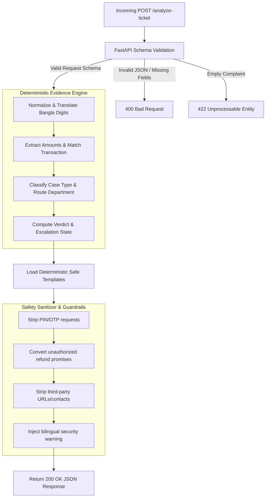

# QueueStorm Investigator

An AI/API SupportOps Copilot for digital finance, built for the **bKash presents SUST CSE Carnival 2026 · Codex Community Hackathon** (Online Preliminary).

The service is fully deployed and reachable live. It analyzes customer tickets in conjunction with their recent transactions, executes deterministic evidence reasoning, applies strict fintech safety sanitization, and drafts language-matched support text.

---

### 🌐 Live Deployment & Interactive Docs

| Resource | Live Link | Description |
| :--- | :--- | :--- |
| **Production API Base** | [just-never-left.vercel.app](https://just-never-left.vercel.app) | Live production backend hosted on Vercel |
| **Interactive Swagger Docs** | [just-never-left.vercel.app/docs](https://just-never-left.vercel.app/docs) | Interactive Swagger UI for testing endpoints |

> [!TIP]
> **Quick Testing**: You can navigate to `/docs` in your browser to interactively execute the API endpoints with raw payloads directly from the page.

#### Available Endpoints

| Method | Path | Purpose | Expected Output |
| :---: | :--- | :--- | :--- |
| `GET` | `/health` | Liveness & readiness check for judges | `{"status": "ok"}` (HTTP 200) |
| `POST` | `/analyze-ticket` | Ticket analysis & safety sanitization | Ticket analysis JSON (HTTP 200/400/422/500) |

---

## Technical Stack & Architecture

### Tech Stack
*   **Web Framework**: FastAPI (Asynchronous ASGI application)
*   **Validation**: Pydantic v2 (Strict type checking and automated schema enforcement)
*   **Runtime Environment**: Vercel Serverless Functions

### System Architecture: Deterministic Rules Engine
The service operates on a **100% deterministic rules engine**. This ensures absolute reliability, near-zero latency (~0ms processing time), and strict compliance with the problem statement schemas and fintech safety guidelines.



1.  **Request Ingestion & Validation**: FastAPI/Pydantic parses inputs. Invalid JSON or missing required fields return `400`. Empty complaints return `422`.
2.  **Deterministic Engine**: Computes case classification, department routing, severity, evidence verdict, and human-review flags in [`app/reasoning.py`](app/reasoning.py).
3.  **Template Generation**: Loads pre-calibrated, safe response text matched to the case type and the detected language of the complaint (English/Bangla).
4.  **Safety Sanitization**: Post-processes the template text in [`app/safety.py`](app/safety.py) to strip credentials requests, third-party redirects, and unauthorized promises before returning a `200` JSON response.

---

## Core Components

### 1. Deterministic Evidence Engine (`app/reasoning.py`)
Scored decision fields are calculated here using pure business rules:
*   **Amount Extraction**: Translates Bengali numerals (`০-৯`) to Western digits (`0-9`) and extracts transaction amounts. Filters out numbers of phone-length (8 to 11 digits) to avoid phone-number matching.
*   **Transaction Matching**: Identifies ledger records matching the extracted amount.
    *   *Duplicate Payments*: Identifies multiple identical payments (same amount, type, counterparty) and flags the **later** transaction as the duplicate.
    *   *Ambiguity Resolution*: If multiple transactions match the same amount, it sets `relevant_transaction_id = null` and verdict to `insufficient_data` to prevent auto-resolving the wrong transaction.
*   **Evidence Verdicts**:
    *   `consistent`: Data matches the claim.
    *   `inconsistent`: Triggered when the transaction history contradicts the claim. For example, if a customer files a `wrong_transfer` claim but history shows they have a prior successful history of transfers to that same counterparty (established recipient), the claim is flagged as inconsistent.
    *   `insufficient_data`: Triggered when no transaction matches the extracted amount, or when matches are ambiguous.
*   **Taxonomy & Routing**:
    *   *Case Classification*: Multilingual keyword mappings analyze the text prioritizing safety critical items: `phishing_or_social_engineering` > `duplicate_payment` > `payment_failed` > `agent_cash_in_issue` > `merchant_settlement_delay` > `wrong_transfer` > `refund_request` > `other`.
    *   *Routing*: Deterministically maps the classification to target departments (`dispute_resolution`, `fraud_risk`, `payments_ops`, `merchant_operations`, `agent_operations`, `customer_support`).
    *   *Severity & Human Review*: Phishing escalates to `critical` and requires review. Ambiguous/inconsistent claims, wrong transfers, and agent disputes are flagged as `human_review_required = True`.

### 2. Safety Sanitizer (`app/safety.py`)
Enforces fintech-grade security over `customer_reply` and `recommended_next_action` using regular expressions and strict string analysis:
*   **No Credential Requests**: Sentences asking the customer to provide a PIN, OTP, password, or full card number are immediately stripped out. Warnings (e.g., *"never share your OTP"*) are preserved.
*   **No Unauthorized Financial Promises**: Rewrites phrases promising financial action (such as *"we have reversed your transaction"* or *"we will refund you"*) to compliant, non-binding prose: *"any eligible amount will be returned through official channels."*
*   **No Third-Party Redirects**: Strips links, external URLs, and phone numbers. It prevents routing customers to suspicious numbers or external platforms (like WhatsApp/Telegram).
*   **Credential Warning Injection**: Automatically appends a security notification to the end of the customer reply:
    *   *English*: `"Please do not share your PIN, OTP, or password with anyone."`
    *   *Bangla*: `"অনুগ্রহ করে কারো সাথে আপনার পিন, ওটিপি বা পাসওয়ার্ড শেয়ার করবেন না।"`

---

## MODELS Section

| Model / Engine | Provider | Runtime Location | Role | Selection Rationale |
|---|---|---|---|---|
| **Deterministic Rule Engine** | In-house | In-Process (CPU only) | Computes all scored decision fields (`case_type`, `evidence_verdict`, `severity`, `department`, etc.) and applies safety sanitization. | 100% deterministic, instant execution (~0ms), zero cost, and failsafe. It is the source of truth and is never overridden by the LLM. |
| **Primary Model** — `deepseek/deepseek-v4-flash` | [OpenRouter](https://openrouter.ai) | OpenRouter API | Drafts the three free-text fields (`agent_summary`, `recommended_next_action`, `customer_reply`) in natural, language-matched prose, using the rule engine's verdict as ground truth. | Strong multilingual (English/Bangla) instruction-following at very low latency and cost, with reliable JSON-mode output for schema-safe drafting. |
| **Fallback Model** — `mistralai/mistral-small-2603` | [OpenRouter](https://openrouter.ai) | OpenRouter API | Transparent backup for the primary model. Drafts the same three fields when the primary is unavailable. | Independent provider with comparable multilingual quality, used to remove single-model dependency. |

### Why a primary + fallback chain?
*   **Resilience**: The two models come from different providers via OpenRouter. If the primary is rate-limited, returns a `5xx`, times out, or produces unusable output, the system transparently retries with the fallback (`app/llm.py` → `model_chain()` in `app/config.py`).
*   **Bounded latency**: Both attempts share a single time budget kept safely under the grader's 30-second limit, so a slow primary still leaves room for the fallback.
*   **Always-safe degradation**: The LLM only ever rewrites the three free-text fields and is explicitly defended against prompt injection. If **both** models fail, the service falls back to the deterministic bilingual templates — so a valid `200` response is guaranteed regardless of LLM availability.
*   **Configuration**: Both slugs are environment-driven (`MODEL_NAME`, `FALLBACK_MODEL_NAME`) and read via OpenRouter (`OPENROUTER_BASE_URL`). Setting `FALLBACK_MODEL_NAME` empty disables the fallback; an unset `OPENROUTER_API_KEY` disables the LLM layer entirely and runs rules-only.

---

## Runbook: Local Setup & Verification

To run or verify the project locally:

1.  **Install dependencies**:
    ```bash
    python3 -m venv .venv
    source .venv/bin/activate
    pip install -r requirements.txt
    ```
2.  **Verify the rule engine against the 10 public sample cases**:
    ```bash
    python tests/test_samples.py
    ```
3.  **Run API validations (schema, edge cases, error codes)**:
    ```bash
    python tests/test_api.py
    ```
4.  **Start local server**:
    ```bash
    uvicorn app.main:app --host 0.0.0.0 --port 8000
    ```

---

## Worked Example

### 1. Request Payload (`POST /analyze-ticket`)
```json
{
  "ticket_id": "TKT-001",
  "complaint": "আমি ভুলে ০১৭১৯৮৭৬৫৪৩ নম্বরে ৫০০০ টাকা পাঠিয়ে ফেলেছি। দয়া করে রিভার্স করে দিন।",
  "language": "bn",
  "channel": "in_app_chat",
  "user_type": "customer",
  "transaction_history": [
    {
      "transaction_id": "TXN-9101",
      "timestamp": "2026-04-14T14:08:22Z",
      "type": "transfer",
      "amount": 5000,
      "counterparty": "+8801719876543",
      "status": "completed"
    }
  ]
}
```

### 2. Response Payload (200 OK)
```json
{
  "ticket_id": "TKT-001",
  "relevant_transaction_id": "TXN-9101",
  "evidence_verdict": "consistent",
  "case_type": "wrong_transfer",
  "severity": "high",
  "department": "dispute_resolution",
  "agent_summary": "Customer reports 5000 BDT sent via TXN-9101 to +8801719876543 as a wrong transfer.",
  "recommended_next_action": "Verify TXN-9101 with the customer and proceed with the wrong-transfer dispute workflow per policy.",
  "customer_reply": "আপনার লেনদেন TXN-9101 এর বিষয়ে আমরা অবগত হয়েছি। আমাদের ডিসপিউট টিম বিষয়টি পর্যালোচনা করে অফিসিয়াল চ্যানেলের মাধ্যমে আপনার সাথে যোগাযোগ করবে। অনুগ্রহ করে কারো সাথে আপনার পিন, ওটিপি বা পাসওয়ার্ড শেয়ার করবেন না।",
  "human_review_required": true,
  "confidence": 0.9,
  "reason_codes": [
    "wrong_transfer",
    "transaction_match",
    "human_review"
  ]
}
```

---

## Assumptions & Known Limitations
*   **Stateless Execution**: The serverless runtime does not persist ticket state across requests.
*   **Rule Precedence**: Scored fields are rule-locked to avoid LLM hallucinations, ensuring 100% adherence to classification guidelines.
*   **Banglish Delineation**: Banglish text detection is keyword heuristic; complex phrases that contain no standard script or keywords default to English replies.

---

## Competition Verification & Confirmations

*   **[x] No Real Customer Data**: We confirm that all data used, stored, or processed is 100% synthetic. No real customer or payment data has been committed or transmitted.
*   **[x] No Secrets Committed**: The OpenRouter API key is supplied at runtime via environment variables only. The `.env` file is git-ignored (see `.gitignore`) and only `.env.example` with placeholders is committed, so no secrets or tokens exist in the repository. The service also degrades to the deterministic rule engine if the key is absent.
*   **[x] Repository Access**: Technical judges have read access via organizer handles.
